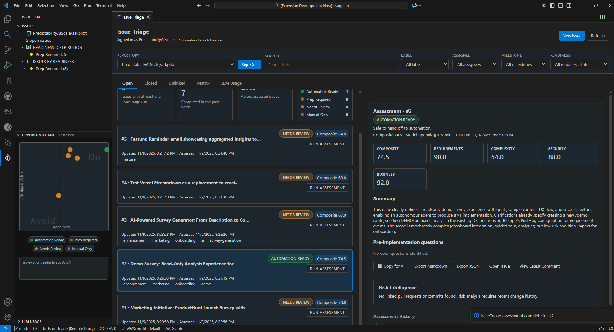
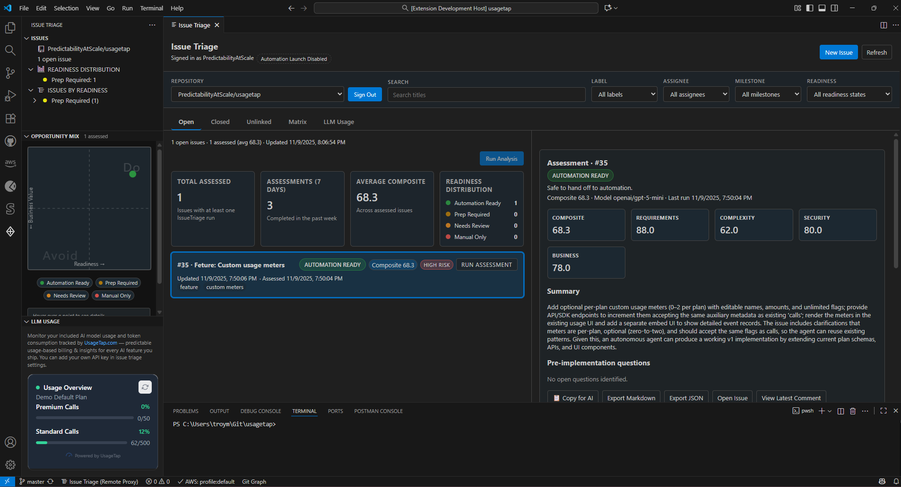
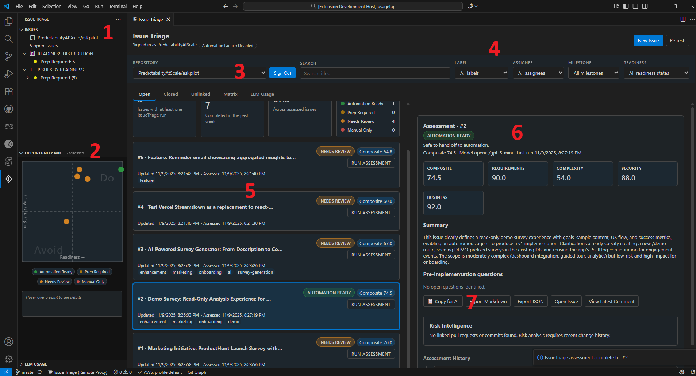
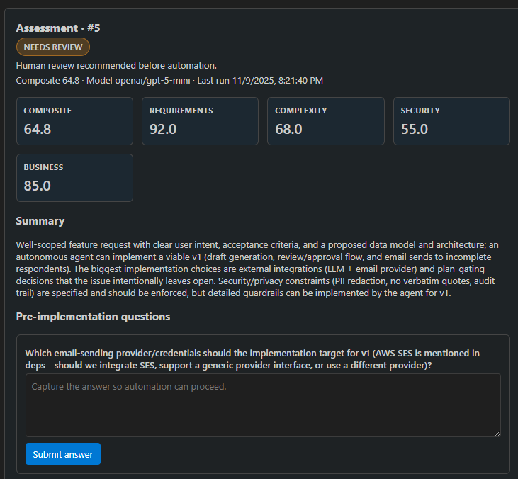

# IssueTriage

**Intelligent AI Readiness for GitHub Issues**

IssueTriage turns every GitHub backlog into an automation-ready funnel. Inside VS Code and Cursor you can triage issues, surface historical risk, run context-aware AI assessments, and decide which work can safely go to coding agents.



## Why Teams Use IssueTriage

- **Prioritize by evidence** – Composite readiness scores combine requirements clarity, code complexity, security sensitivity, and business impact.
- **Catch hidden risk** – Linked pull requests, change volume, and review friction automatically temper optimistic scores.
- **Work where you code** – Native sidebar views, commands, and status bar entry points for both VS Code and Cursor.
- **Stay in control** – All assessment and risk data is stored locally in SQLite; you decide whether to publish results back to GitHub.

### Built for Technical Leads

- Deep GitHub integration: issues, labels, assignees, milestones, linked PRs, commit history.
- Flexible LLM routing: remote Cloudflare worker proxy or direct OpenRouter calls with your own key.
- CLI tool orchestration: attach workspace diagnostics and custom scripts to assessment prompts.
- Optional UsageTap telemetry: track LLM usage while honoring opt-out preferences.

## Architecture at a Glance

| Layer | What It Does |
| --- | --- |
| **GitHub auth & data** | Device-code OAuth, repository discovery, issue snapshots, linked PR hydration. |
| **Assessment service** | Builds structured prompts, calls OpenRouter, validates JSON responses, persists history. |
| **Risk intelligence** | Computes metrics from PRs and commits, derives risk levels, applies score adjustments. |
| **CLI context tools** | Runs built-in or custom commands, streams output into assessments, caches recent runs. |
| **Storage** | Local `assessments.db` and `risk-profiles.db` (sql.js) plus VS Code secret storage for tokens. |

## Interface Tour

### 1. Full Assessment Panel

- Tabbed layout (Issues, ML Training, LLM Usage).
- Score breakdown, summary, recommendations, automation badge, assessment history timeline.
- Risk Intelligence section with top drivers and PR evidence.



### 2. Activity Bar Sidebar

- Repository selector, readiness distribution, grouped issue lists (Not Assessed, Ready, Prep Required, Needs Review, Manual Only).
- Inline quick actions: assess, refresh, send to automation.
- Color-coded badges that mirror assessment readiness.



### 3. Opportunity Mix Matrix

- Scatter plot of business value vs. readiness using assessed issues only.
- Hover to inspect, click to open GitHub, legend keyed to readiness states.

### 4. Assessment Question Flow

- Guided checklist for automation readiness questions, each with AI-assisted answers and follow-up prompts.



## Workflow

1. **Connect** – Run `Issue Triage: Connect Repository` and complete the device-code sign-in.
2. **Explore** – Use the sidebar or matrix to find high-value candidates or risky outliers.
3. **Assess** – Trigger `Issue Triage: Assess Selected Issue`; IssueTriage gathers CLI context, calls the LLM, and updates history.
4. **Act** – Share results via optional GitHub comment, continue refinement, or launch automation if enabled.

## Quick Start (VS Code & Cursor)

1. Install **IssueTriage** from the marketplace (works identically in Cursor).
2. Open the command palette → `Issue Triage: Connect Repository` → authorize in the browser.
3. Choose your LLM mode:
   - **Remote (default)** – Requests go through the hosted Cloudflare worker, no local key required.
   - **Local** – Provide your own OpenRouter key via `.env` (`ISSUETRIAGE_OPENROUTER_API_KEY`) or settings.
4. Open the panel (`Issue Triage: Open Panel`) or sidebar icon, select a repository, and run your first assessment.

## Configuration Highlights

### LLM Modes

```jsonc
// settings.json
{
  "issuetriage.assessment.llmMode": "remote",           // or "local"
  "issuetriage.assessment.remoteEndpoint": "",          // override worker URL (remote mode)
  "issuetriage.assessment.standardModel": "openai/gpt-5-mini",
  "issuetriage.assessment.premiumModel": "openai/gpt-5",
  "issuetriage.assessment.usePremiumModel": false
}
```

### Custom CLI Context Tools

```jsonc
{
  "issuetriage.cliTools": [
    {
      "id": "test-coverage",
      "title": "Test Coverage Report",
      "command": "npm",
      "args": ["run", "test:coverage"],
      "cwd": "${workspaceRoot}",
      "autoRun": true,
      "refreshIntervalMs": 300000,
      "enabled": true
    }
  ]
}
```
Tokens supported: `${workspaceRoot}`, `${workspaceFolder}`, `${extensionRoot}`.

### Risk Intelligence Tuning

```jsonc
{
  "issuetriage.risk.lookbackDays": 180,
  "issuetriage.risk.labelFilters": ["bug", "feature"],
  "issuetriage.risk.publishComments": true
}
```

### Automation Launch Guard

```jsonc
{
  "issuetriage.automation.launchEnabled": false
}
```
Only enable when your downstream AI coding agent integration is ready.

## Command Palette Reference

| Command | Purpose |
| --- | --- |
| `Issue Triage: Open Panel` | Show the full assessment webview. |
| `Issue Triage: Connect Repository` | Authenticate and select a GitHub repository. |
| `Issue Triage: Change Repository` | Switch between accessible repositories. |
| `Issue Triage: Refresh Issues` | Pull the latest backlog snapshot. |
| `Issue Triage: Assess Selected Issue` | Run an AI assessment for a chosen issue. |
| `Issue Triage: Run Context Tool` | Execute a configured CLI helper manually. |
| `Issue Triage: Backfill Keywords` | Extract historical keywords for ML training. |
| `Issue Triage: Export Training Dataset` | Generate training data manifest and archive. |
| `Issue Triage: Send to Automation` | Queue an automation-ready issue (when enabled). |
| `Issue Triage: Sign Out` | Clear GitHub credentials and cached tokens. |

## Readiness Categories

| Composite Score | Category | Recommended Action |
| --- | --- | --- |
| 80–100 | 🟢 Automation Ready | Launch automation or hand off to AI agent. |
| 60–79 | 🟡 Prep Required | Address recommendations, clarify requirements, rerun assessment. |
| 40–59 | 🟠 Needs Review | Break down work, add tests, capture missing context, reassess. |
| 0–39 | 🔴 Manual Only | Keep the work with humans; automate only after major refactor. |

Risk intelligence multiplies composite scores by **0.8** (high risk) or **0.9** (medium risk) when history indicates caution.

## Telemetry & Privacy

- Local-first storage: assessment and risk databases live under VS Code global storage.
- GitHub comments: controlled via `issuetriage.assessment.publishComments` and `issuetriage.risk.publishComments`.
- Telemetry: disable entirely with `issuetriage.telemetry.enabled = false`.
- UsageTap integration: optional debug logs via `issuetriage.telemetry.usagetapDebug`.
- Source code never leaves your machine unless your custom CLI tools transmit data.

## Troubleshooting Checklist

- **Auth problems** – Rerun `Issue Triage: Sign Out`, ensure the verification URL is reachable, and restart the editor.
- **Missing API key (local mode)** – Confirm `.env` or settings contain `ISSUETRIAGE_OPENROUTER_API_KEY`; reload after changes.
- **Provider errors** – Check OpenRouter status, switch to the standard model, or retry once rate limits reset.
- **Empty issue list** – Verify you have repo access and refresh via the command palette.
- **Risk data missing** – Ensure issues have linked PRs/commits within the configured lookback window.

## Requirements

- VS Code 1.95.0+ or Cursor (latest builds).
- GitHub account with repository access.
- Network access to `github.com` and OpenRouter (or your configured proxy).
- Optional: OpenRouter API key for local LLM mode.

## Release Notes (0.0.11)

- Opportunity Mix matrix webview inside the sidebar.
- Expanded assessment panel with risk intelligence, automation guard, and history timeline.
- ML Training tab with keyword backfill and dataset export workflows.
- CLI context tool orchestration with auto-run support and output history.
- Remote (worker-proxied) and local OpenRouter LLM modes with premium toggle.
- UsageTap LLM usage tracking with opt-in telemetry controls.

---

Triage faster, ship safer. [Report issues](https://github.com/PredictabilityAtScale/IssueTriage/issues) or [explore the code](https://github.com/PredictabilityAtScale/IssueTriage).
